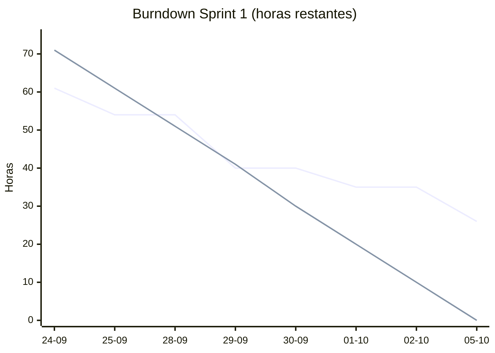

# Métricas del Sprint 1

**SPRINT-1-T30 · Métricas del Sprint 1 (burndown y velocidad)**
**Responsable:** Luis Hernández (Scrum Master)
**Período:** 24-09-2026 al 05-10-2026
**Fuentes:** tablero de Notion e historial de Pull Requests integrados a `main` en GitHub

## 1. Resumen

| Métrica | Valor |
|---|---|
| Puntos comprometidos | 13 (E1-H1: 8 · E1-H2: 5) |
| Horas estimadas (T01–T21) | 71 h |
| Horas completadas | 45 h (**63 %**) |
| Tareas completadas | 13 de 21 |
| Pull Requests integrados | 10 (#1, #3, #4, #5, #6, #7, #8, #9, #11, #12) |
| Pull Requests con cambios solicitados | 1 (#10) |
| Migraciones de base de datos | 3 (`init`, `desglose_cierre_caja`, `auditoria_inmutable`) |

## 2. Estado de las historias

| Historia | Puntos | Backend | Frontend | Verificación | Estado |
|---|---|---|---|---|---|
| E1-H1 Gestión de usuarios y roles | 8 | ✅ Completo (T04–T08) | ⏳ En revisión, PR #10 con cambios solicitados (T09–T11) | ⏳ T17 pendiente | En curso |
| E1-H2 Auditoría de operaciones críticas | 5 | ✅ Completo (T12–T15) | ⏳ T16 pendiente | ⏳ T18 pendiente | En curso |

**Velocidad del Sprint 1:** en Scrum solo se cuentan los puntos de historias **aceptadas** en el Sprint Review. Ambas historias tienen el backend completo, pero falta su frontend y la verificación de criterios, así que la velocidad se confirma en el Sprint Review. El avance real del sprint, medido en horas, es del **63 %**.

## 3. Tareas por estado (al 05-10-2026)

| Estado | Tareas | Horas |
|---|---|---|
| Hecho (13) | T01, T02, T03, T04, T05, T06, T07, T08, T12, T13, T14, T15, T21 | 45 |
| En revisión, PR #10 con cambios solicitados (3) | T09, T10, T11 | 13 |
| Por hacer (5) | T16, T17, T18, T19, T20 | 13 |
| **Total** | **21** | **71** |

> T12 (entidad de auditoría) se completó dentro del modelo de datos de T04: la tabla `audit_logs` forma parte de la migración `init`.

## 4. Burndown (horas restantes)

La línea ideal reparte las 71 h en partes iguales entre el día 0 y el día 7. Cada tarea descuenta sus horas el día en que su PR se integró a `main`. Los PR integrados en fin de semana se cuentan el siguiente día hábil.

| Día | Fecha | Integrado ese día | Horas restantes reales | Horas restantes ideales |
|---|---|---|---|---|
| 0 | Jue 24-09 | T01, T02, T03 (PR #1) | 61 | 71 |
| 1 | Vie 25-09 | T04 + T12 (PR #3) | 54 | 61 |
| 2 | Lun 28-09 | — | 54 | 51 |
| 3 | Mar 29-09 | T05, T21, T06, T07 (PR #4 a #7) | 40 | 41 |
| 4 | Mié 30-09 | — | 40 | 30 |
| 5 | Jue 01-10 | T08 (PR #8) | 35 | 20 |
| 6 | Vie 02-10 | — | 35 | 10 |
| 7 | Lun 05-10 | T13 (PR #9, dom 04-10), T14 (PR #11), T15 (PR #12) | 26 | 0 |

**Lectura:** el equipo avanzó por delante o en línea con lo ideal hasta el 29-09. Desde el 30-09 la curva se separó, por dos motivos: el frontend se concentró en un único PR al final del sprint (PR #10) y quedaron sin iniciar las tareas de cierre (QA y documentación).

## 5. Distribución del trabajo completado

| Integrante | Tareas completadas | Horas |
|---|---|---|
| Nicolás Jiménez | T01, T02, T03, T06, T08, T13, T14, T15, T21 | 32 |
| Luis Hernández | T04, T05, T07, T12 | 13 |
| Lucas Flores | — (T09–T11 en revisión) | 0 |
| **Total** | | **45** |

> T04 y T05 fueron trabajadas en local por Luis Hernández y subidas a `main` por Nicolás Jiménez; T07 la desarrolló Luis con apoyo de Nicolás en la integración.

## 6. Calidad

| Métrica | Valor |
|---|---|
| Tests automatizados del backend | 87/87 en verde al integrar T13 |
| PR integrados con revisión | 10 de 10 |
| PR rechazados en revisión | 1 (#10: 5 bloqueantes) |
| Defectos detectados antes de llegar a `main` | 5 bloqueantes en revisión del PR #10 |
| Dependencia no planificada detectada | Seed de locales y endpoint `GET /stores` |

## 7. Conclusiones para el Sprint 2

1. **Planificar menos o dividir más.** El Sprint 2 tiene 21 pts planificados (E1-H3: 13 · E2-H1: 8), un 62 % más que los 13 del Sprint 1, que no se cerraron por completo. Conviene confirmar en el Sprint Planning si se mantiene el alcance o se mueve parte de E2-H1.
2. **Integrar el frontend de forma continua.** Un PR por tarea de frontend durante el sprint, no uno grande al final.
3. **Revisar dependencias de datos en el planning.** Seeds y catálogos (como los locales) deben aparecer como tareas desde el inicio.
4. **Registrar horas reales.** En el Sprint 1 solo se midieron horas estimadas; agregar una columna "Horas reales" al tablero permitirá calcular la precisión de las estimaciones.
5. **Iniciar las tareas de cierre antes.** QA y documentación deben empezar a mitad del sprint, no el último día.
